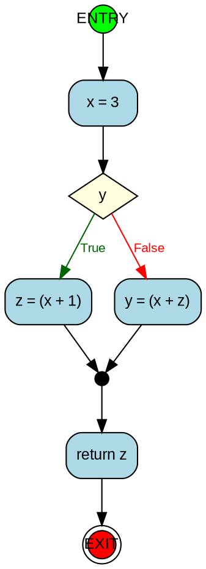

## Universidad Nacional de Villa Mercedes - Escuela de Ingeniería y Ciencias Ambientales
# Proyecto de Compiladores + Análisis Estático de Programas
### Alumnos:
- Molina, Santiago Manuel
- Quiroga Stek, Esteban Eduardo
- Sanabria Quattrocchio, Pablo Emiliano
- Videla Del Castillo, Florencia Fatima

# Documentación del Compilador

## 📋 Tabla de Contenidos
1. [Introducción](#introducción)
2. [Instalación y Configuración](#instalación-y-configuración)
3. [Arquitectura](#arquitectura)
4. [Componentes](#componentes)

---

## Introducción

### ¿Qué es este proyecto?

Este es un **compilador educativo** desarrollado en Java que implementa un compilador completo con las tres fases fundamentales: análisis léxico, análisis sintáctico y análisis semántico. El compilador genera código assembler x86-64 a partir de un lenguaje simple de alto nivel.

Como extensión para la materia **Análisis Estático de Programas**, se agrega la construcción del **Grafo de Flujo de Control (CFG)** desde el AST, con exportación al formato DOT de Graphviz.

### Características principales

- **Análisis Léxico**: Tokenización usando JFlex
- **Análisis Sintáctico**: Parsing usando CUP (Java Cup) generando un Árbol Sintáctico Abstracto (AST)
- **Análisis Semántico**: Validación de tipos, scopes y variables
- **Generación de Código**: Producción de código assembler x86-64
- **CFG**: Construcción del Grafo de Flujo de Control a partir del AST
- **Visualización**: Exportación del CFG a formato DOT (Graphviz)
- **Manejo de Errores**: Sistema completo con errores léxicos, sintácticos, semánticos y de tipos
- **Suite de Tests**: 12 casos de prueba cobriendo diferentes escenarios


### Ejemplo de código compilable

```c
int main() {
    int x = 10;
    int y = 20;
    int resultado;

    if (x < y) {
        resultado = x + y;
    } else {
        resultado = x - y;
    }

    return resultado;
}
```

### Requisitos previos

- Java 11 o superior
- Maven 3.6+
- Git
- Graphviz (opcional, para visualizar el CFG generado)

### Inicio rápido

```bash
# Clonar el repositorio
git clone <url-repositorio>
cd compiler

# Compilar el proyecto
mvn clean compile

# Ejecutar con archivo de prueba (Windows)
mvn exec:java "-Dexec.args=src/main/resources/test_cfg.txt"

# Ejecutar con archivo de prueba (Linux/Mac)
mvn exec:java -Dexec.args="src/main/resources/test_cfg.txt"

# Visualizar el CFG generado
dot -Tpng src/main/resources/test_cfg.dot -o cfg.png
```

---

## Instalación y Configuración

### Instalación paso a paso

#### 1. Preparar el ambiente

```bash
java -version
javac -version
mvn --version
```

#### 2. Clonar y compilar el proyecto

```bash
git clone <url-repositorio> compiler
cd compiler
mvn clean compile

# Ejecutar (Windows)
mvn exec:java "-Dexec.args=src/main/resources/{nombre_archivo}.txt"

# Ejecutar (Linux/Mac)
mvn exec:java -Dexec.args="src/main/resources/{nombre_archivo}.txt"
```

La generación del parser y el lexer están automatizados en el `pom.xml`.

### Estructura del proyecto

```
compiler/
├── pom.xml
└── src/
    └── main/
        ├── java/
        │   ├── CompilerMain.java           # Punto de entrada
        │   ├── ast/                        # Árbol sintáctico abstracto
        │   │   ├── ASTNode.java
        │   │   ├── nodes/
        │   │   │   ├── expression/         # BinaryOpNode, NumberNode, VariableNode...
        │   │   │   ├── statement/          # AssignmentNode, IfStmtNode, WhileStmtNode...
        │   │   │   └── program/            # ProgramNode, FunctionDefNode, ParamNode
        │   │   ├── visitor/
        │   │   │   └── ASTVisitor.java
        │   │   └── utils/
        │   │       └── ASTUtils.java
        │   ├── cfg/                        # Grafo de Flujo de Control
        │   │   ├── CFGBuilder.java         # Construcción del CFG desde el AST
        │   │   ├── CFGNode.java            # Nodo y arista del CFG
        │   │   └── DOTExporter.java        # Exportador a formato Graphviz
        │   ├── cup/
        │   │   └── parser.cup
        │   └── jflex/
        │       └── lexer.flex
        └── resources/                      # Archivos de prueba y salidas .dot / .asm
```

---

## Arquitectura

### Pipeline del CFG Builder

```
Código Fuente (.txt)
        │
        ▼
┌─────────────┐
│    Lexer    │  JFlex → Tokens
└──────┬──────┘
       │ Tokens
       ▼
┌─────────────┐
│   MiParser  │  CUP → AST (ProgramNode)
└──────┬──────┘
       │ AST
       ▼
┌─────────────┐
│  CFGBuilder │  AST → Lista de CFGNodes
└──────┬──────┘
       │ Lista de CFGNodes
       ▼
┌─────────────┐
│ DOTExporter │  CFG → archivo .dot
└─────────────┘
       │
       ▼
  archivo .dot  (visualizable con Graphviz o en línea)
```

### Gramática del lenguaje (parser.cup)

```
program    → integer id ( ) { stmt_list }
stmt_list  → stmt+
stmt       → id = expr ;
           | return expr ;
           | if ( expr ) { stmt_list } else { stmt_list }
           | while ( expr ) { stmt_list }
expr       → value + value | value
value      → id | number
```

---

## Componentes

### 1. CompilerMain

Punto de entrada del pipeline. Orquesta las tres fases: parseo, construcción del CFG y exportación DOT.

```java
public static void main(String[] args)
```

Ejecuta en orden:

**Fase 1 — Análisis Léxico y Sintáctico:**
```java
ProgramNode ast = parseFile(inputFile);
```

**Fase 2 — Construcción del CFG:**
```java
CFGBuilder cfgBuilder = new CFGBuilder();
cfgBuilder.build(ast);
cfgBuilder.printCFG();
```

**Fase 3 — Exportación DOT:**
```java
String dot = DOTExporter.export(cfgBuilder.getAllNodes());
// Guarda el .dot junto al archivo de entrada
```

Al finalizar imprime el comando Graphviz para visualizar el grafo:
```
dot -Tpng test_cfg.dot -o cfg.png
dot -Tsvg test_cfg.dot -o cfg.svg
```

---

### 2. CFGBuilder

Construye el Grafo de Flujo de Control a partir del AST. El patrón de construcción es recursivo: cada método retorna un par `{nodoEntrada, nodoSalida}` que representa la subred del CFG para esa sentencia.

#### Método principal

```java
public void build(ProgramNode program)
```

Crea los nodos especiales `ENTRY` y `EXIT`, procesa la lista de sentencias del cuerpo de la función y los conecta.

#### Métodos de acceso

```java
public CFGNode       getEntryNode()  // nodo ENTRY
public CFGNode       getExitNode()   // nodo EXIT
public List<CFGNode> getAllNodes()   // todos los nodos del CFG
public void          printCFG()     // imprime representación textual por stdout
```

#### Métodos de construcción (privados)

Cada método retorna `CFGNode[] { entryNode, exitNode }`:

```java
private CFGNode[] processStmtList(List<StmtNode> stmts)
```
Procesa una secuencia de sentencias conectándolas en cadena. Si la lista está vacía, crea un nodo `skip`.

```java
private CFGNode[] processStmt(StmtNode stmt)
```
Delega al método específico según el tipo concreto de sentencia (`AssignmentNode`, `ReturnStmtNode`, `IfStmtNode`, `WhileStmtNode`). Para tipos no reconocidos, crea un nodo genérico con el `toString()` del nodo.

```java
private CFGNode[] processAssignment(AssignmentNode node)
```
Crea un único nodo `STATEMENT` con etiqueta `"variableName = expresión"`. El nodo es a la vez entrada y salida del subgrafo.

```java
private CFGNode[] processReturn(ReturnStmtNode node)
```
Crea un nodo `STATEMENT` con etiqueta `"return expresión"` y lo conecta directamente al nodo `EXIT`. Retorna `null` como nodo de salida para indicar que no hay flujo normal de continuación.

```java
private CFGNode[] processIf(IfStmtNode node)
```
Construye la estructura de ramificación del `if/else`:

```
     condNode (CONDITION)
    /                    \
 True                  False
  /                        \
thenBranch             elseBranch (o directo a joinNode si no hay else)
    \                      /
     ──→  joinNode (JOIN) ←──
```

Si no hay rama `else`, la arista `False` va directamente al `joinNode`.

```java
private CFGNode[] processWhile(WhileStmtNode node)
```
Construye el bucle con back-edge:

```
     condNode (CONDITION) ←──────────────┐
    /                    \               │
 True                  False             │
  /                        \             │
bodyStatements          afterWhile       │
    │                  (JOIN, salida)    │
    └────────────────────────────────────┘ (back edge)
```

#### Métodos auxiliares privados

```java
private CFGNode createNode(String label, CFGNode.NodeType type)
```
Crea un nodo con ID autoincremental y lo agrega a `allNodes`.

```java
private void addEdge(CFGNode from, CFGNode to, String label)
```
Crea una `CFGEdge` y la registra en los sucesores de `from` y en los predecesores de `to`.

---

### 3. CFGNode

Representa un nodo del CFG. Contiene su tipo, etiqueta, lista de aristas salientes (sucesores) y lista de aristas entrantes (predecesores).

#### Tipos de nodo (`CFGNode.NodeType`)

| Tipo | Forma en DOT | Descripción |
|---|---|---|
| `ENTRY` | Círculo verde | Punto de entrada del programa |
| `EXIT` | Doble círculo rojo | Punto de salida del programa |
| `STATEMENT` | Rectángulo azul | Sentencia simple: asignación o return |
| `CONDITION` | Rombo amarillo | Condición de `if` o `while` |
| `JOIN` | Punto | Confluencia de ramas o salida de bucle |

#### Constructor

```java
public CFGNode(int id, String label, CFGNode.NodeType type)
```

#### Métodos de acceso

```java
public int              getId()           // ID único del nodo
public String           getLabel()        // etiqueta (texto del nodo)
public NodeType         getType()         // tipo del nodo
public List<CFGEdge>    getSuccessors()   // aristas salientes
public List<CFGEdge>    getPredecessors() // aristas entrantes
```

#### Métodos de modificación

```java
public void addSuccessor(CFGEdge edge)
public void addPredecessor(CFGEdge edge)
```

#### Métodos de consulta

```java
public boolean isBranch() // true si tiene más de un sucesor
public boolean isJoin()   // true si tiene más de un predecesor
```

#### Clase interna: CFGEdge

Representa una arista dirigida entre dos nodos.

```java
public static class CFGEdge {
    public CFGNode getFrom()    // nodo origen
    public CFGNode getTo()      // nodo destino
    public String  getLabel()   // "True", "False" o "" para aristas normales
}
```

---

### 4. DOTExporter

Exporta la lista de nodos del CFG al formato DOT de Graphviz. Es una clase de utilidad con un único método estático.

#### Método principal

```java
public static String export(List<CFGNode> nodes)
```

Genera un string con el grafo completo en formato DOT. El string puede escribirse directamente a un archivo `.dot`.

#### Configuración general del grafo generado

```dot
digraph CFG {
    rankdir=TB;
    fontname="Arial";
    node [fontname="Arial", fontsize=12];
    edge [fontname="Arial", fontsize=10];
    ...
}
```

#### Representación visual por tipo de nodo

| Tipo | Atributos DOT |
|---|---|
| `ENTRY` | `shape=circle`, `fillcolor=green` |
| `EXIT` | `shape=doublecircle`, `fillcolor=red` |
| `STATEMENT` | `shape=box, style="rounded,filled"`, `fillcolor=lightblue` |
| `CONDITION` | `shape=diamond, style=filled`, `fillcolor=lightyellow` |
| `JOIN` | `shape=point, width=0.15` |

#### Representación visual de aristas

| Etiqueta | Color |
|---|---|
| `"True"` | Verde oscuro (`darkgreen`) |
| `"False"` | Rojo (`red`) |
| `""` (normal) | Negro (por defecto) |

#### Métodos privados auxiliares

```java
private static String nodeId(CFGNode node)
// Retorna "n" + node.getId() — identificador único en el archivo DOT

private static String escapeLabel(String label)
// Escapa caracteres especiales: \ " y \n para uso seguro en labels DOT
```

#### Ejemplo de salida



---

## Archivos de prueba

| Archivo | Descripción |
|---|---|
| `test_cfg.txt` | Programa simple con `if/else` |
| `test_cfg_while.txt` | Programa con bucle `while` |
| `test_cfg_completo.txt` | Programa con `if` anidado dentro de `while` |